# pbkk-101

<h3 align="center"><a href="https://pbkk-101.duckdns.org/">https://pbkk-101.duckdns.org/</a></h3>


- [Website unavailable for you to see? guide to local deploy](#local-deployment)

## Progress Tracker

- [x] **Home Page** - Profil Mahasiswa Kelompok 2
- [x] **About Page** - Profil Departemen Teknik Informatika ITS
- [x] **Project Idea** - Agentic AI Platform
- [x] **Tantangan 1** - `GET '/hitung/{angka1}/{angka2}/{operasi}'`
- [x] **Tantangan 2** - Kustomisasi Visual (Tailwind CSS, Responsive)


## Rangkuman Hasil Website

### 1. Home Page ( Profil Mahasiswa Kelompok 2 )

| 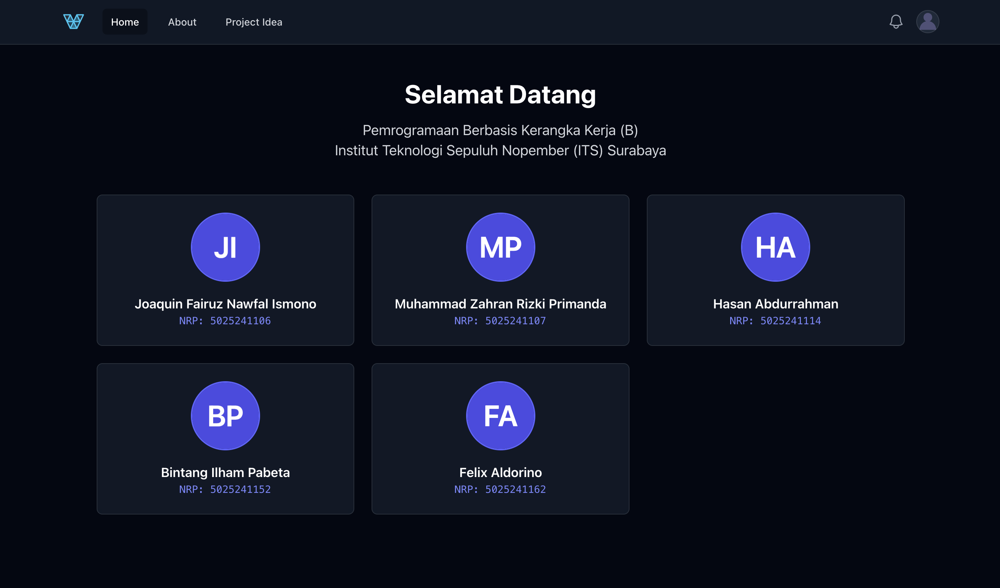 |
| :--: |
| Pada tampilan Home, terdapat profil anggota kelompok 2 yang terdiri atas Nama Lengkap dan NRP dari masing-masing mahasiswa |

  
### 2. About Page

| 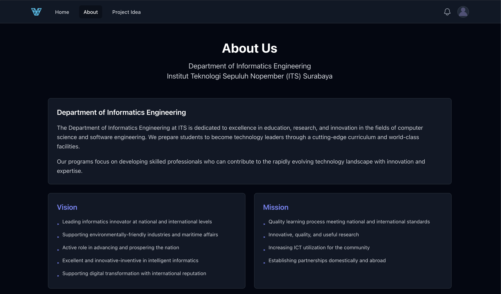 |
| :--: |
| Pada tampilan About, terdapat profil singkat mengenai Departemen Teknik Informatika ITS yang  berisikan deskripsi singkat, visi dan misinya. |

| 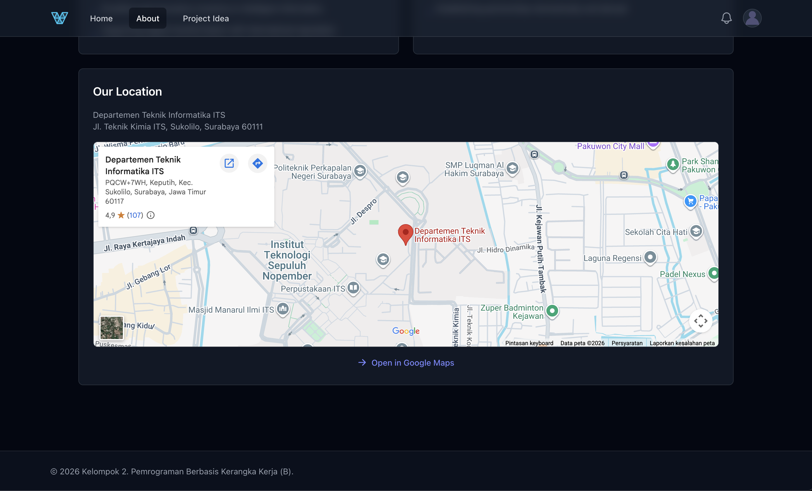 |
| :--: |
| Serta lokasi dari Departemen Teknik Informatika ITS |


### 3. Project Idea Page

| 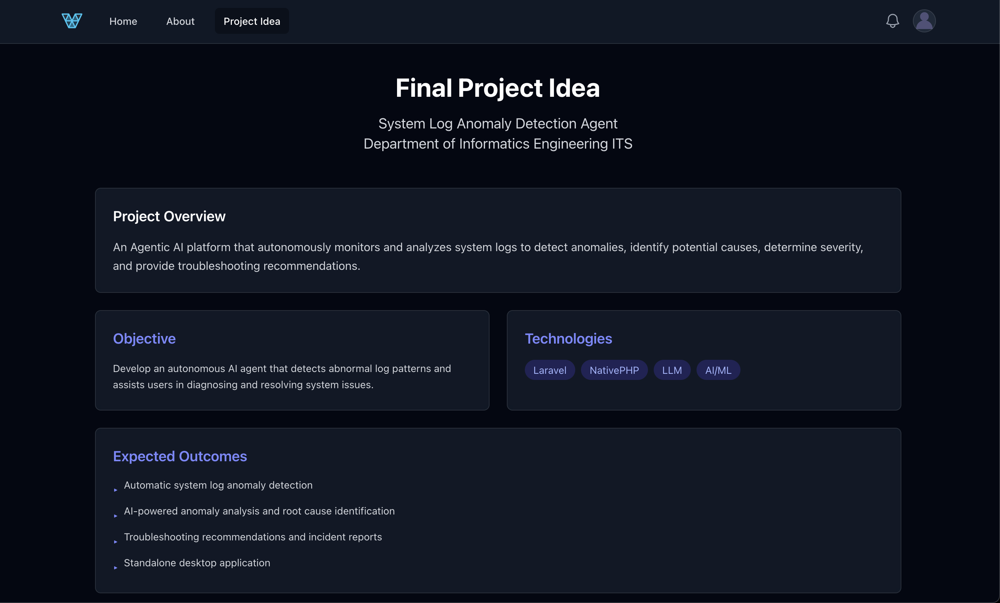 |
| :--: |
| Pada tampilan Project Idea, terdapat overview dan tujuan dari ide projek yang ingin kami lakukan ( Tema : monitoring dan analisis log sistem untuk menemukan masalah pada sistem )  

| 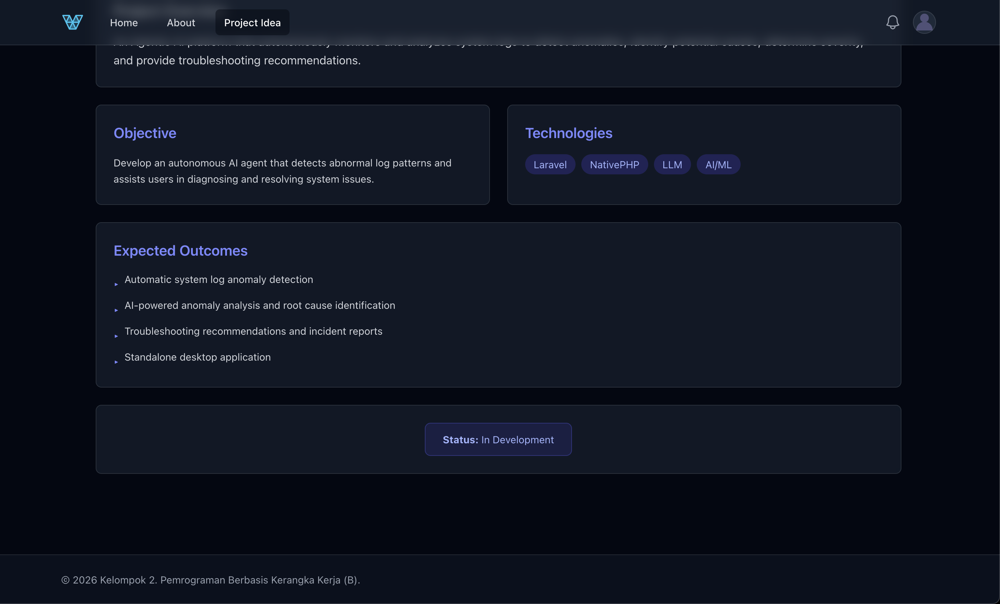 |
| :--: |
| Beserta harapan kami dari projek tersebut dan status development dari projek tersebut ( sekarang tercatat sebagai "in development" ) |


### 4. Tantangan 1: ``GET '/hitung/{angka1}/{angka2}/{operasi}'``

| 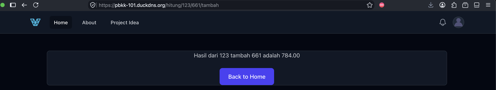 |
| :--: |
| 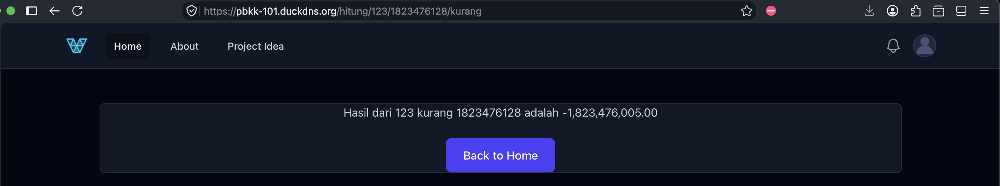 |
| 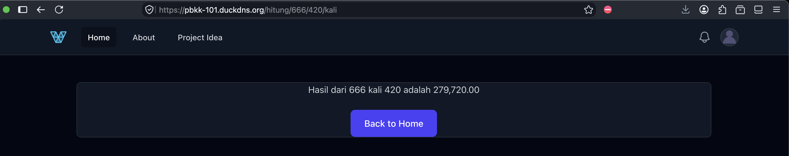 |
| 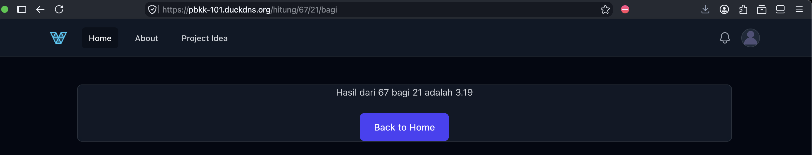 |


### 5. Tantangan 2: Kustomisasi Visual

Layout responsif dan menggunakan framework CSS (tailwindcss) untuk styling. Navbar telah diimplementasikan dengan memperhatikan layout yang responsif.

| Android | Navbar Expanded |
| :--: | :--: |
| 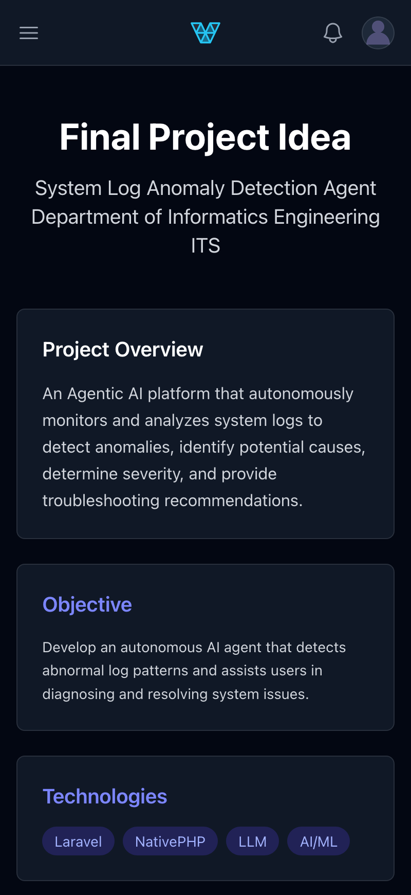 | 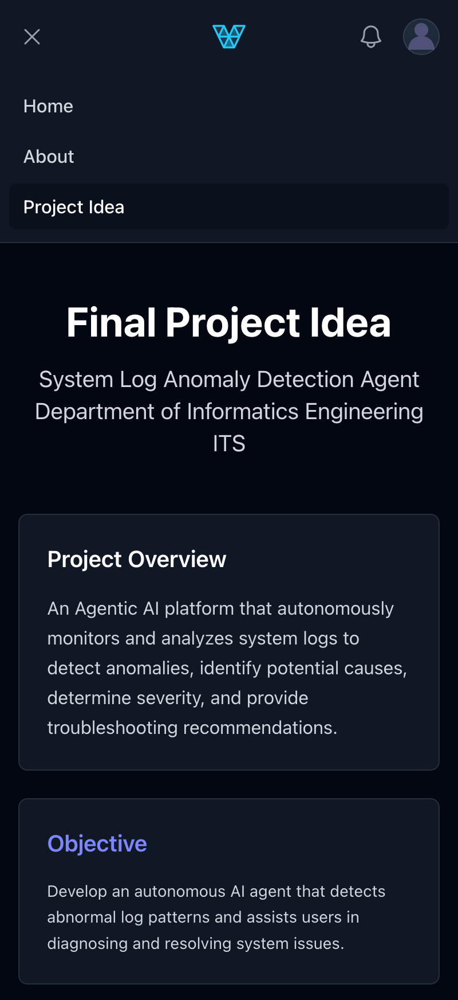 |


### Bonus: 404 Handler

| 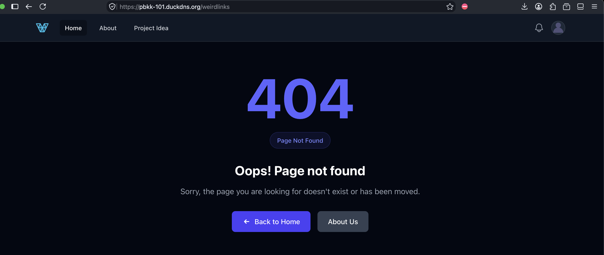 |
| :--: |


---


## Local Deployment

1. **Clone the repository**

    ```bash
    git clone https://github.com/ilhmpbta/pbkk-101
    cd pbkk-101
    ```

    * Or if you already have the repository cloned, you can pull the latest changes
    
        ```bash
        git pull
        ```

2. **Install dependencies**

    ```bash
    composer install
    npm install
    ```

3. **Copy environment file**

    ```bash
    cp .env.example .env
    php artisan key:generate
    php artisan config:clear
    ```

4. **Create database**

    ```bash
    touch database/database.sqlite
    php artisan migrate
    ```

    * If you use windows, you have to create the database file with the following command
    
        ```bash
        New-Item -Path "database\database.sqlite" -ItemType File
        php artisan migrate
        ```

5. **Start the app**

    ```bash
    npm run start
    ```

---
